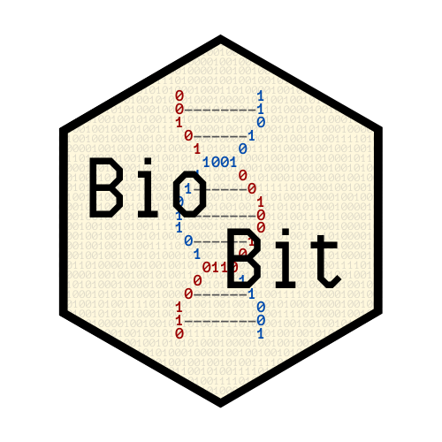

```{r setup, include=FALSE}
knitr::opts_chunk$set(echo = FALSE)
```

[BioBit](https://biobit.netlify.app) is a blog dedicated to spread and communicate bioinformatics to society. I made it using the R package `distill` and to publish it I used Netlify, because GitHub pages force me to have it as a subdomain of my personal website.

My goal with the blog is posting basic things and recent advances about bioinformatics, as well as some biology and computer science -although I won't post much about it, since I am a bioscientist rather than a computer one-. 

Moreover, I have also explained how I made the blog using Rmarkdown and `distill`, as well as the steps I followed to make my personal website using a simple Rmarkdown page and why I changed to a Distill Blog for it.

I wish that you will like what I have to say and you will have fun reading it.

You can take a look at the blog at https://biobit.netlify.app.

```{r out.width="35%", fig.align="right"}

```

