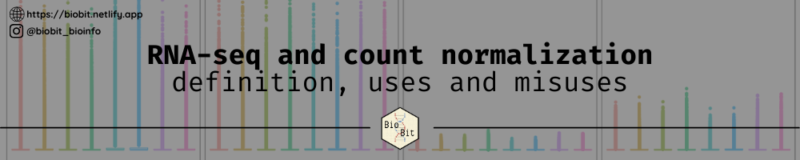
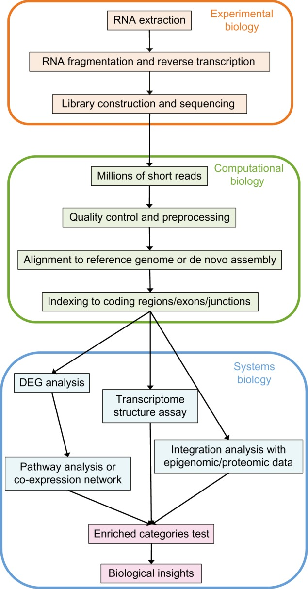

<center>
__Adrià Mitjavila__ on *May 31, 2022*
</center>

<center>
Reposted from [BioBit](https://biobit.netlify.app/post/005-rnaseq-normalizations/).
</center>

---

```{r setup, include=FALSE}
knitr::opts_chunk$set(echo = FALSE, message = FALSE, error = FALSE, warning = FALSE)
```

<br>

<center>

</center>
<br>

---


When analyzing RNA-seq data and studying gene expression levels, we usually start from **counts**, which are sequencing reads mapped to genomic features such as genes. However, using counts as they are to compare different samples (*gene A in sample 1 vs gene A in sample 2*) or even genes within a sample (gene is not a good option, since the amount of counts in a gene will vary a lot depending on how much the sample has been sequenced (**sequencing depth**; different between samples) and the **length of the gene** (different between genes): the more reads mapped in a sample, the more counts the genes in that sample will have, and the longer a gene is, the more counts will it have. For this reason, there is a need to normalize the raw counts for the sequencing depth and the gene length to make them comparable among genes within a sample and different samples.


## What is RNA-seq?

RNA-seq is a high-throughput sequencing technique that aims to reveal the transcriptome, which consists in the presence and quantity of RNA molecules -indicative of the expression of the genes- in a biological sample (tissue, cell culture, single cell...) with a given condition (i.e. differentiation state, healthy/disease state) in other words, the transcriptome is the identity of the sample we are studying.

The study of the transcriptome is called transcriptomics and it has used many methods over time, such as [microarrays](https://en.wikipedia.org/wiki/DNA_microarray), [Sanger sequencing](https://en.wikipedia.org/wiki/Sanger_sequencing), [EST (expression sequence tags)](https://en.wikipedia.org/wiki/Expressed_sequence_tag) and others, but RNA-seq provides a better, cheaper way for transcript identification at a single base-pair resolution and quantification.

For a more specific introduction on RNA-seq, you can look at the following video from [StatQuest](https://statquest.org/statquest-a-gentle-introduction-to-rna-seq/):

<center>
<iframe width="560" height="315" src="https://www.youtube.com/embed/tlf6wYJrwKY" frameborder="0" allow="accelerometer; autoplay; clipboard-write; encrypted-media; gyroscope; picture-in-picture" allowfullscreen></iframe>
</center>

## What is RNA-seq used for?

<!--
https://www.cd-genomics.com/resourse-Applications-of-RNA-Seq.html

https://www.ncbi.nlm.nih.gov/pmc/articles/PMC4648566/pdf/bbi-suppl.1-2015-029.pdf
-->

As mentioned before, RNA-seq is mostly used to quantify the gene expression of the genes in a sample and identifying transcripts at a single base-pair resolution. In addition to that, it can be used for:

* **Differential expression (_DE_) analysis**. DE analysis is probably the most common application of RNA-seq and consists in the comparison of the transcriptomes of two conditions (i.e. disease vs healthy) to if the genes have significant differences in their expressions to reveal the biology behind the studied processes.

* **Detection of exon-intron junctions**. Genes in eukaryotes are formed by two types of sequences: exons and introns. When a gene is expressed and transcribed to RNA, the introns are removed from the mature transcript by a process called **splicing**. With RNA-seq, we can detect the junctions between exons and introns, also called *splice junctions*.

* **Detection of alternative splicing patterns**. Sometimes and under certain conditions, a gene may undergo an "uncommon" process of splicing (**alternative splicing**) where some exons may be removed along introns or even some introns may be retained in the mature RNA. If a read (piece of DNA/RNA that is sequenced) maps to two non consecutive exons, we will be able to detect alternative splicing patterns.

* **Quantification of transcript isoforms**. Each gene may have different transcripts, with different lengths, transcription starting sites and transcription ending sites, and with RNA-seq we can quantify these transcript isoforms.

And many other things.

### What are counts?

When we sequence DNA or RNA, not all the molecule is sequenced at once. Instead, the fragments that are sequenced are shorter, ranging from tenths of base-pairs to hundreds or even thousands of base-pairs with new technologies. 

Depending on the RNA-seq protocol, what the sequencing reads may have different lengths, but normally these reads will be rather short (i.e. 50 base-pairs). After sequencing and controlling the quality of the reads we normally map these reads to a reference genome -an already assembled genome of the species that we are studying- or assembly these transcripts *de novo* into a transcriptome.

After that, these reads will be assigned to different genomic features -such as genes, exons, introns or transcripts-. The **reads assigned to these genomic features are the counts**, which provide a measure of transcript abundance.

<center style="color:blue;">
```{r fig.cap='Overview of the typical RNA-seq pipeline. <ins><em>Source:</em></ins> <a href="https://www.ncbi.nlm.nih.gov/pmc/articles/PMC4648566/" target="_blank">Fig.1 of <em>Han et al. 2015</em></a>', out.width="30%"}

```
</center>

## Why we have to normalize the counts?

In the sequencing, a sample A can be sequenced with more total reads (more **sequence depth**) than another sample B. This will imply that the same gene in sample A could have more counts than in sample B, without a biological reason. For this reason, it seems logical to **normalize by the sequencing depth**.

Moreover, there are difference among different genes. Since every gene has a unique length, it seems obvious that longer genes (or other features) will have more reads mapped to them than shorter genes, also without the real expression being higher. A solution for this can be the **normalization by the length of the gene**.

The most usual methods to normalize counts are RPKM, FPKM and TPM, although other methods performed for different softwares such as [`DESeq2`](https://bioconductor.org/packages/release/bioc/html/DESeq2.html) or [`edgeR`](https://bioconductor.org/packages/release/bioc/html/edgeR.html) can be often used when doing differential expression analysis:

* **RPM**s (*reads per million mapped reads*) or **CPM**s (*counts per million mapped reads*) are counts normalized by sequence depth. RPM are not commonly used in RNA-seq, but are useful to calculate other normalized units and are calculated as follows:

$$
RPM \; or \; CPM = \frac{Reads \; mapped \; to \; a \; gene  \; \times \; 10^6}{Total \; number \; of \; reads \; in \; a \; sample} 
$$

* **RPKM**s (*reads per kilobase per million mapped reads*) and **FPKM**s (*fragments per kilobase per million mapped reads*) are essentially the same normalization methods for [single-end and paired-end](https://genohub.com/next-generation-sequencing-guide/#type) sequencing respectively. Shortly, in single-end a single read is considered a fragment, while in paired-end a fragment is made by two reads. These units, which are very used in gene expression analyses, normalize the counts per gene length (*per kilobase*; $10^3$) and sequencing depth (*per million mapped reads*; $10^6$) and are calculated dividing the RPMs by the length of the gene divided by 10^3^:

$$
RPKM \; or \; FPKM = \frac{Reads \; or \; fragments \; mapped \; to \; a \; gene  \; \times  \; 10^6  \; \times 10^3}{Total \; number \; of \; reads \; in \; a \; sample \; \times \; Gene \; length \; in \; base-pairs}
$$

* **TPM**s (*Transcripts per million mapped reads*) also consider normalization by gene length and sequencing depth. To calculate them, you must divide the reads mapped to a gene by the gene length in kilobases, obtaining *RKM*s of that gene (*reads per kilobase*; normalization by gene length). Then divide them by the sum of *RPK* values for all genes in the sample divided by 10^6^ (normalization by sequencing depth), such as follows:

$$
TPM =  RPK \times \frac{10^6}{\sum\limits_{i}^{all \; genes} RPK}
$$

<br>
<center>where $RKM$ are calculated as:</center>
<br>

$$
RKM = \frac{Reads \; mapped \; to \; a \; gene \; \times \; 10^3}{Gene \; lenght \; in \; base-pairs}
$$
All the previously mentioned normalization units can be used either to compare different genes within a sample or a gene between different samples -although they are not usually adopted for the last- and we may call them **within-sample normalization**, because only the information within the sample is used to normalize the counts. However, there are other methods that use **between-samples normalization**, which is useful to compare the expression of a gene between different samples, but should not be used to compare different genes within a sample. 

These *between-samples normalization* methods, which are not explained here, are mainly used by packages dedicated to perform differential expression analysis, such as [DESeq2](https://bioconductor.org/packages/release/bioc/html/DESeq2.html) or [edgeR](https://bioconductor.org/packages/release/bioc/html/edgeR.html).

For more information about the normalization methods, watch the following video from [StatQuest](https://statquest.org/):

<center>
<iframe width="560" height="315" src="https://www.youtube.com/embed/TTUrtCY2k-w" frameborder="0" allow="accelerometer; autoplay; clipboard-write; encrypted-media; gyroscope; picture-in-picture" allowfullscreen>
</iframe>
</center>

## Which normalization method should we use?

In my case, I mainly use RNA-seq to both compare genes within the same sample and to compare genes between samples (*differential expression analysis*), so I normally use FPKM or TPM for the first and DESeq2 for the second.

When comparing genes within a sample, until now, FPKM were a very popular normalization unit, but TPM are taking the lead, why? If we use FPKM, the sum of all the values might be different across samples, making it difficult to compare between samples, even if they are replicates of the same condition, whereas TPM don't have this problem.

However, even if TPM are better than FPKM, it is not recommended to perform differential expression analysis -which search quantitative differences between genes- using neither of them. In differential expression analysis, we assume that the same gene has the same length across all conditions, hence since we compare the same gene in different conditions it is not necessary to account for gene length normalization. Nevertheless, we need to account for **RNA composition**, this is few highly deferentially expressed genes between samples, differences in the number of genes expressed in each sample or presence of contaminants which can skew other normalization methods.

Hence, if you want to quantitatively **compare gene expression between samples**, you should use normalization methods such as the ones that are performed by *DESeq2* or *edgeR*, whereas if you want to **compare expression of genes within a samples** you should use TPM.

## Bibliography

### Journal articles

Han *et al* (2015). **Advanced Applications of RNA Sequencing and Challenges**. *Bioinformatics and biology insights*. Online [here](https://doi.org/10.4137/BBI.S28991)

Wagner *et al* (2012). **Measurement of mRNA abundance using RNA-seq data: RPKM measure is inconsistent among samples**. *Theory Biosci*. Online [here](https://doi.org/10.1007/s12064-012-0162-3)

Wang *et al* (2009). **RNA-Seq: a revolutionary tool for transcriptomics**. *Nature Reviews Genetics*. Online [here](https://doi.org/10.1038/nrg2484)

Zhao *et al* (2021). **Misuse of RPKM or TPM normalization when comparing across samples and sequencing protocols**. *RNA*. Online [here](https://rnajournal.cshlp.org/content/early/2020/04/13/rna.074922.120.full.pdf)

### Other sourcess

Harvard Bioinformatics Core (2019). **Introduction to DGE: Count normalization with DESeq2**.  DGE workshop*. Online [here](https://hbctraining.github.io/DGE_workshop/lessons/02_DGE_count_normalization.html). Consulted on 2021-02-25.

Renesh Bedre (2021). **Gene expression units explained: RPM, RPKM, FPKM, TPM, DESeq, TMM, SCnorm, GeTMM, and ComBat-Seq**. *Renesh Bedre Data Science Blog*. Online [here](https://www.reneshbedre.com/blog/expression_units.html). Consulted on 2021-02-25

StatQuest (2015). **RPKM, FPKM and TPM, clearly explained**. *RNA-seq blog*. Online [here](https://www.rna-seqblog.com/rpkm-fpkm-and-tpm-clearly-explained/). Consulted on 2021-02-25.

CD-Genomics. **Applications of RNA-Seq**. Online [here](https://www.cd-genomics.com/resourse-Applications-of-RNA-Seq.html). Consulted on 2021-02-25.


