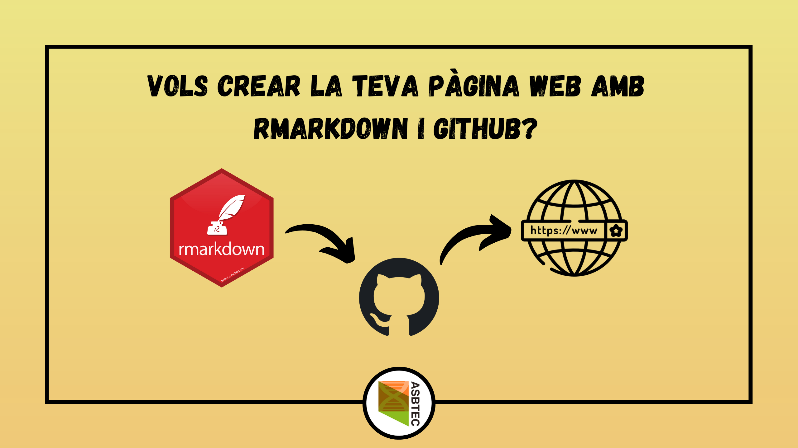
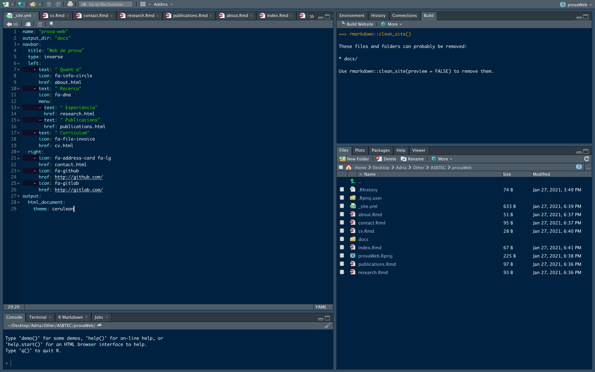

---
categories:
- Cursos
date: 2021-01-27
tags:
- Web
- RMarkdown
- GitHub
title: "Com fer una pàgina web amb Rmarkdown i GitHub pages"
---

```{r setup, include=FALSE}
knitr::opts_chunk$set(echo = FALSE, fig.align = "center")
```

<br><br>

```{r portada, out.width="100%"}

```

<br><br>

R és un llenguatge de programació/*scripting* amb el qual es poden fer infinitat de coses: tractament i visualització de dades, anàlisis estadístiques, anàlisis de dades òmiques i altres tipus de dades biològiques (ep, això és interessant per a nosaltres, biotecnòlegs!) i, si ens endinsem a la fusió d'R amb *Markdown* (*Rmarkdown*) fins i tot *currículums vitae*, pàgines web i blogs.

Doncs avui ens interessa publicar una pàgina web o blog propi mitjançant *Rmarkdown* i el que s'anomena *GitHub pages*. Sí, ja sabem que podem fer una pàgina web de manera més senzilla (o no) i amb una interfície gràfica més fàcil d'utilitzar mitjançant Wordpress o altres plataformes web, però sempre és útil saber com fer-ho des d'altres plataformes, ja sigui fent servir HTML, CSS i PHP o fent servir *Rmarkdown* per a crear arxius HTML de la nostra pàgina. 

A més, si utilitzem *Rmarkdown*, podrem publicar fragments de codi i anàlisis que fem en el nostre dia a dia i que ens pot interessar donar a conèixer a altres persones, cosa que és una mica menys senzill mitjançant plataformes que no siguin *Rmarkdown*. Per exemple, aquesta publicació està feta a partir d'un fitxer *Rmarkdown* i publicada a un lloc web que funciona amb Wordpress, però per a fer això, he hagut de copiar tot el codi HTML creat a partir del fitxer *.Rmd* i copiar-lo a una entrada del blog de Wordpress, mentre que amb GitHub pages hagués sigut tant senzill com una ordre  al terminal del sistema o com carregar el fitxer sencer al repositori de GitHub on tinc tota la meva pàgina web.

# Requeriments

Primer de tot, cal recalcar que farà falta tenir determinats requeriments:

* Tenir [R](https://www.r-project.org/) i [RStudio](https://rstudio.com/) instal·lats.
* Tenir instal·lats tots els paquets d'R necessaris per a crear la nostra web.
* Tenir un compte de [GitHub](https://github.com/), de [GitLab](https://gitlab.com/) o de [BitBucket](https://bitbucket.org/). Aquí ensenyarem com dur a terme el procés amb GitHub, però les altres dues opcions són igual de viables i la metodologia no canvia gaire.
* Conèixer a grans trets com funcionen RStudio i GitHub.
* Conèixer la [sintaxi d'Rmarkdown](https://rmarkdown.rstudio.com/lesson-1.html).

# Web o blog?

Una de les coses que necessitarem decidir és si volem una web o un blog... però quina és la diferència entre aquestes dues coses?

La diferència és senzilla:

* Un lloc web és un conjunt de pàgines dins un mateix domini a les quals podem accedir a través d'internet.
* Un blog és un lloc web on una d'aquestes pàgines serveix per llistar o enumerar una sèrie de publicacions.

La majoria de pàgines web personals publicades a partir del mètode que explicarem aquí, així com aquelles publicades amb Wordpress i altres, consisteixen en blogs o tenen algun blog enllaçat, però no és estrictament necessari crear un blog si no tenim pensat fer publicacions de manera habitual.

# Què és GitHub?

Conèixer R i RStudio, així com la sintaxi d'Rmarkdown és una cosa que durem a terme en el nostre primer curs *Inicia't a R*, un curs escrit íntegrament en català dedicat als socis de l'ASBTEC. Per tant, això ens ho saltarem i explicarem el que és GitHub i de què es tracta.

GitHub és una plataforma per a l'emmagatzematge de codi que permet la col·laboració entre desenvolupadors i el que s'anomena control de versió, que no és res més que un conjunt d'eines de desenvolupament de *software* que ens ajuden a veure els canvis que hem dut a terme en un codi concret al llarg del temps. 

Per a fer-ho més simple, podríem dir que GitHub (així com les altres plataformes) és una mena de xarxa social on els usuaris creen repositoris de codi (el que serien les publicacions) que van actualitzant a mesura que milloren o canvien aquest codi. 

Per a crear un compte, simplement hem d'anar a <https://github.com> i clicar a *Sign up*, senzill oi? Una vegada tinguem el compte creat, podrem configurar el nostre perfil i crear els repositoris que volguem, mitjançant la icona <i class="fas fa-plus"></i> de dalt a la dreta.

Nosaltres generarem tots els fitxers HTML mitjançant *Rmarkdown* i publicarem la nostra pàgina de manera gratuïta a GitHub pages mitjançant un repositori de nom especial (`usuari.github.io`), on `usuari` és el nom que li hem donat al nostre usuari de GitHub.

Aquí teniu una guia ràpida de com utilitzar [GitHub](https://guides.github.com/activities/hello-world/).

# Passos a seguir

Un cop tinguem R i RStudio instal·lats, els passos a seguir (dins d'RStudio) per a crear i publicar la nostra pàgina web són els següents:

1. Instal·lar totes les dependències (paquets) necessàries.
2. Crear un projecte d'R mitjançant una plantilla (*template*) adient per a crear pàgines web.
3. Generar tots els fitxers HTML que configuraran cada pàgina del nostre lloc web i  generar els fitxers CSS (*opcional*) per donar format al nostre lloc web.
4. Configurar l'organització del lloc web utilitzant, per exemple, un fitxer anomenat `_site.yaml`.
5. Crear el compte de GitHub (si no el tenim) i el repositori `usuari.github.io`, el qual ha de ser públic.
6. Carregar (fer *commit* i *push*) de tota la carpeta on tenim els fitxers de la pàgina web al repositori `usuari.github.io`.
7. Configurar el repositori per a habilitar les *GitHub pages* i dir-li a GitHub on ha de buscar els documents HTML.

## Pas 1. Instal·lar les dependències

Els paquets que haurem d'instal·lar són paquets dedicats a la creació de pàgines web i blogs. D'aquests n'hi ha molts, encara que nosaltres ens basarem en el paquet `rmarkdown`:

* **`rmarkdown`**: paquet senzill que ens aporta diverses utilitats del llenguatge *Rmarkdown* i que ens permet utilitzar una plantilla senzilla per a la creació de pàgines web (però no blogs). Podeu trobar més informació sobre aquest paquet a <https://rmarkdown.rstudio.com/lesson-1.html> i instal·lar-lo mitjançant l'ordre `install.packages("rmarkdown")`.
* **`distill`**: paquet que ens permet utilitzar més plantilles per a fer una web o un blog, així com funcions que ens permetran crear publicacions i/o pàgines pel nostre lloc web de manera molt senzilla, ja que la seva estructura és molt similar a les webs creades amb el paquet `rmarkdown`, amb molts avantatges i alguns inconvenients. Podeu trobar més informació sobre aquest paquet a <https://rstudio.github.io/distill/> i instal·lar-lo mitjançant l'ordre `install.packages("distill")`. 
* **`blogdown`**: paquet especialitzat en la creació de blogs, que ens permet tenir una flexibilitat a l'hora de configurar la nostra web i que disposa de diversos temes per a donar un format visual diferent al blog que crearem. És una mica més complicat d'utilitzar, però podeu trobar-ne més informació a <https://bookdown.org/yihui/blogdown/> i instal·lar-lo mitjançant l'ordre `install.packages('blogdown')`.

<br>
Altres paquets per a la creació de llocs web no personals (llibres, paquets d'R, projectes en general), els quals us seran més útils si us dediqueu a la (bio)informàtica, (bio)estadística, etc:

* **`bookdown`**: aquest paquet està dissenyat per a la creació de llibres, però el format dels llibres també pot ser en línea com una pàgina web. Més informació a <https://bookdown.org/yihui/bookdown/>.
* **`pkgedown`**: paquet dissenyat per a la creació de llocs web destinats a la documentació de paquets. Més informació a <https://pkgdown.r-lib.org/>.
* **`workflowr`**: paquet dissenyat per a la creació de llocs web (ja siguin locals o publicats a internet) destinats organitzar les anàlisis i les dades d'un projecte, així com facilitar la seva reproducibilitat i la col·laboració. Més informació a <https://jdblischak.github.io/workflowr/>.

<br>
Les altres dependències dependran del codi que volguem executar a les nostres pàgines o publicacions del lloc web. A continuació teniu alguns paquets útils, encara que no els explicarem: 

* `knitr`: paquet amb funcions que ens permetran incloure imatges (ex. `include_graphics()`), donar format de taula a matrius o *data frames* (ex. `kable()`), entre moltes altres, quelcom interessant a l'hora de fer CVs, etc. Més informació [aquí](https://yihui.org/knitr/).
* `tidyverse`: conjunt de paquets que fan molt senzills el tractament i modificació d'estructures de dades (matrius, *data frames*, mitjançant el paquet `dplyr`) així com la visualització de gràfics (mitjançant `ggplot2`), etc.
* ...

## Pas 2. Crear un projecte d'R

```{r fig.show="hold", out.height="20%", out.width="49%", fig.align = "default", fig.cap="Figura 1. Passos necessaris per a crear un projecte d'R."}
knitr::include_graphics(c("newRproject.png", "newRproject_directory.png", "newRproject_type.png", "newRproject_name.png"))
```

Una vegada tinguem les dependències instal·lades (bàsicament el paquet `rmarkdown` o el que desitgem), crearem un projecte d'R seguint els següents passos:

1. Anem a la icona de dalt a la dreta i cliquem a *New Project...* (Figura 1, panell superior esquerra). 
2. A finestra que se'ns obra a continuació (Figura 1, panell superior dret), indiquem *New Directory*, si volem crear el projecte en una nova carpeta (aconsellable), o *Existing Directory*, si volem crear el projecte a un directori ja existent (millor si està buit).
3. Seguidament se'ns obra una nova finestra (Figura 1, panell inferior esquerra) on hem d'indicar el tipus de projecte que volem. El més senzill és indicar *Simple R Markdown Website* (que és el que explicarem), encara que si volem fer un blog amb `distill` podem clicar a *Distill Blog* i si volem utilitzar `blogdown` podem clicar *Website using blogdown*.
4. Finalment, a la següent finestra (Figura 1, panell inferior dret), hem d'indicar el directori on volem crear el nostre projecte i clicar a *Create Project*.

Un cop haguem fet això es crearà la carpeta corresponent al nostre projecte juntament amb diversos fitxers:

* `_site.yml`: arxiu que ens permetrà l'organització dels fitxers generats per a la nostra web. És obligatori disposar d'aquest arxiu.
* `index.Rmd`: arxiu `.Rmd` que ens servirà per a crear l'arxiu `index.html` que serà la pàgina inicial (*Home*) del nostre lloc web. És obligatori disposar d'aquest arxiu.
* `about.Rmd`: arxiu `.Rmd` que ens servirà per a crear l'arxiu `index.html` que, per defecte és la pàgina *About* del nostre lloc web. Aquest arxiu no és obligatori, ja que depèn només ens serveix per a crear una pàgina extra al nostra lloc web.

## Pas 3. Generar els fitxers HTML

Per a generar els fitxers HTML que configuraran les pàgines del lloc web podem fer-ho de diverses maneres.

* Escriure els fitxers HTML directament, cosa que no és recomanable pels que no dominen aquest llenguatge i que és força tediosa.
* Crear documents *R Markdown* i renderitzar-los a HTML. Aquesta és l'opció més senzilla i en la que ens centrarem:

  + Un cop tinguem tots els fitxers *R Markdown* creats i el fitxer `_site.yml` configurat, per a construir la pàgina podem anar a la pestanya *Build* de dalt a la dreta i clicar a *Build Website* (Figura 2).
  + Podem crear tants fitxers *R Markdown* com volguem i renderitzar-los a HTML, però per a què apareixin a la pàgina web hem de posar-los al fitxer `_site.yml` (exepte l'`index.html`, que serà la pàgina inicial del nostre lloc web encara que no el posem explicitament).
  + Als fitxers *R Markdown*, normalment hi tenim una *capçalera YAML* (al principi del document entre dos blocs de tres guions `---`), amb diverses opcions. En aquest cas només cal indicar el `title`, ja que les opcions com `output`... les indicarem al fitxer `_site.yml`.

```{r rstudio_screen, fig.show="hold", out.width="100%", fig.align = "default", fig.cap="Figura 2. Pantalla d'RStudio on es mostra el fitxer '_site.yml' de la web de prova a l'editor (panell superior esquerra), la pestanya 'Build' (panell superior dret) i la distribució del directori on tindrem guardat el lloc web (panell inferior dret)."}

```

  
## Pas 4. Configurar el fitxer `_site.yml`

Com hem vist al pas 2, al crear el projecte s'ha generat un fitxer `_site.yml` que ens servirà per organitzar les pàgines del lloc web. Aquest és el codi del fitxer creat per defecte:

```
name: "my-website"
navbar:
  title: "My Website"
  left:
    - text: "Home"
      href: index.html
    - text: "About"
      href: about.html
```

En aquest exemple trobem diversos paràmetres:

* `name:` nom de la web
* `output_dir:` aquesta opció no apareix al fitxer `_site.yml` que tenim per defecte, però és important especificar-la i posar `"docs"` (els fitxers HTML es crearan ) o `"."`  
* `navbar:` barra de navegació superior
  + `title:` títol que apareix a la barra de navegació
  + `left:` enllaços o menús que apareixeran a la part esquerra de la pantalla.
      + `text:` text dels enllaços
      + `href:` nom del fitxer HTML de la pàgina que volem posar.
      
Ara bé, com veieu a la **figura 2**, la qual mostra una [pàgina de prova](https://asbtec.github.io/prova-web-rmarkdown/index.html), hi ha moltes més opcions per especificar:

* Dins de `navbar:`

  + `type:` (*opcional*) si indiquem `inverse` canvia els colors del tema del lloc web. Si no ho volem així, no cal especificar-la.
  + `right:` enllaços i menús que ens apareixeran a la part dreta de la barra de navegació.
  
  + Dins de `right` o `left:`
    
      + Cada nova pestanya ha d'anar acompanyada d'un guió `-`.
      + `text:` text que apareixerà a la pestanya de la barra de navegació.
      + `icon:` icona que apareixerà juntament amb el text de la pestanya. No pot ser qualsevol imatge, sinó que hem d'utilitzar les icones de [*Font Awesome*](https://fontawesome.com/icons?d=gallery) indicant `fa-nom_de_la_icona`.
      + `href:` URL o ruta al fitxer que volem enllaçar a la pestanya.
      + `menu:` si volem que la pestanya sigui un menú desplegable, hem d'indicar aquesta opció, i a dins (amb una tabulació, indicarem `text`, `href`...)
      
* `output:` format dels fitxers que volem que es creein a partir dels *R Markdown*. En aquesta opció s'hi pot especificar el mateix que a la capçalera dels fitxers *R Markdown*. Dins d'`output` hi podem posar més opcions:
  
  + `html_document:` indiquem que el fitxer que volem és HTML. Dins d'aquesta opció:
      
      + `theme:` tema que volem utilitxar per a la nostra pàgina web. Alguns exemples de temes són: *cerulean*, *cosmo*, *yeti*, *darkly*, *paper*, *journal*, etc.
      + Hi ha moltes més opcions a afegir tant aquí com a la capçalera dels *R Markdown* (ex. `highlight`, `toc`, `toc_float`, `code_folding`), [aquí](https://bookdown.org/yihui/rmarkdown/html-document.html) podem trobear-ne algunes.
  
Ara ja tenim tot el que necessitem per fer la web i, si cliquem *Build Website*, podrem visualitzar-la de manera local.

## Pas 5. Crear el repositori de GitHub

Si no tenim un compte a GitHub, haurem d'anar <https://github.com> i crear un compte seguint les instruccions. Una vegada haguem creat el compte, ja podrem crear tots els repositoris que volguem per a guardar codi. Aquí en teniu una petita [guia](https://guides.github.com/activities/hello-world/), la qual us hem deixat al principi d'aquesta mateixa publicació.

Per a guardar la vostra web, el que haureu de fer és crear un repositori amb el nom `usuari.github.io`. Per exemple, el meu usuari de GitHub és [*amitjavilaventura*](https://github.com/amitjavilaventura), per tant, el repositori que he de crear per a guardar la meva web és [`amitjavilaventura.github.io`](https://github.com/amitjavilaventura/amitjavilaventura.github.io), que serà el domini que es farà servir per allotjar el lloc web (*Figura 3*). 

També podem crear tots els repositoris que volguem i amb qualsevol nom per allotjar tantes webs com volguem, però aquestes webs s'allotjaran com a subdominis de la web principal (ex. `usuari.github.io/nom_repositori_secundari/`).

```{r fig3, fig.show="hold", out.height="20%", out.width="100%", fig.align = "center", fig.cap="Figura 3. Passos necessaris per a la creació d'un repositori de GitHub amb objectiu d'allotjar una web."}
knitr::include_graphics(c("github_new_repo.png", "github_new_repo2.png", "github_new_repo3.png"))
```


## Pas 6. Carregar tots els fitxers al repositori

Ara que ja tenim el repositori, hem de fer carregar-hi tots els arxius necessaris. Això ho podem fer mitjançant tres mètodes:

* Des de la terminal del sistema (s'hi pot accedir des d'RStudio), una opció fàcil i ràpida una vegada la domines, però complicada d'entendre al principi.
* Des de l'aplicació de *GitHub Desktop*, una opció més assequible, però encara n'hi ha una de més fàcil.
* Des del mateix repositori de GitHub (*Figura 4*), cliquem a *uploading an existing file*, despres arrosseguem els arxius de la carpeta generada al pas 2 i cliquem a *Commit changes* (si volem podem afegir una descripció o canviar el missatge del *commit*).

```{r fig4, fig.show="hold", out.width="100%", fig.align = "center", fig.cap="Figura 4. Com carregar els arxius a un repositori de GitHub."}
knitr::include_graphics(c("github_upload_files1.png", "github_upload_files2.png"))
```


Recordeu que teniu la [guia](https://guides.github.com/activities/hello-world/) que us hem proporcionat al principi i que us pot servir de molta ajuda.

## Pas 7. Configurar 

Una vegada haguem creat el repositori i hi tinguem els fitxers carregats, hem d'anar a la pestanya <i class="fas fa-cog"></i> *Settings* (*Figura 5, panell superior*) i dins d'aquesta pestanya a la secció on diu *GitHub Pages*  (*Figura 5, panell inferior*) hem d'indicar la *Branch* del repositori (vosaltres en tindreu només una, que probablement es digui *master* o *main*) i la carpeta on buscar els fitxers HTML, que serà *docs* o *root* depenent el que hagiu posat a l'opció `output_dir` del fitxer `_site.yml`.

Finalment, haureu de clicar a *Save* (*Figura 5*), esperar una estona, actualitzar la pàgina i quan digui *Your site is published at ...*, ja podreu accedir a la vostra pàgina web personal.

```{r fig5, fig.show="hold", out.width="100%", fig.align = "center", fig.cap="Figura 5. Configurar el repositori de GitHub per allotjar una pàgina web."}
knitr::include_graphics(c("github_pages1.png", "github_pages2.png"))
```

## Pas 8. Gaudir del vostre lloc web

A més, si teniu un domini particular, podeu indicar que voleu que el vostre lloc web s'allotji en aquest domini i no a `usuari.github.io`.

Ara ja podeu del vostre lloc web i podeu anar-lo actualitzant. 

# Recursos

A continuació us deixem alguns recursos, a més dels que ja hem anat donant al llarg de la publicació:

* *R Markdown*

  + [Guia de referència](https://rstudio.com/wp-content/uploads/2015/03/rmarkdown-reference.pdf?_ga=2.208411222.519933327.1611688102-172412930.1604399930)
  + [*Cheat sheet*](https://github.com/rstudio/cheatsheets/raw/master/rmarkdown-2.0.pdf)
  + [Introducció](https://rmarkdown.rstudio.com/lesson-1.html)
  + [Llibre](https://bookdown.org/yihui/rmarkdown/)
  + [Llocs web (capítol 10 del llibre)](https://bookdown.org/yihui/rmarkdown/websites.html)

<br>

* Paquets d'R per a fer webs:
  
  + [`distill`](https://rstudio.github.io/distill/)
  + [`blogdown`](https://bookdown.org/yihui/blogdown/)
  
<br>

* GitHub:
  
  + [Guia ràpida](https://guides.github.com/activities/hello-world/)
  + [*Getting started*](https://docs.github.com/en/github/getting-started-with-github)
  + [*GitHub Pages*](https://pages.github.com/)
  + [*Domini propi*](https://docs.github.com/en/github/working-with-github-pages/configuring-a-custom-domain-for-your-github-pages-site)
  + [*Creating a GitHub Pages site*](https://docs.github.com/en/github/working-with-github-pages/creating-a-github-pages-site)

<br>

* Exemples: 

  + [Lloc web de prova](https://asbtec.github.io/prova-web-rmarkdown/index.html)
  + [Repositori del lloc web](https://github.com/ASBTEC/prova-web-rmarkdown)